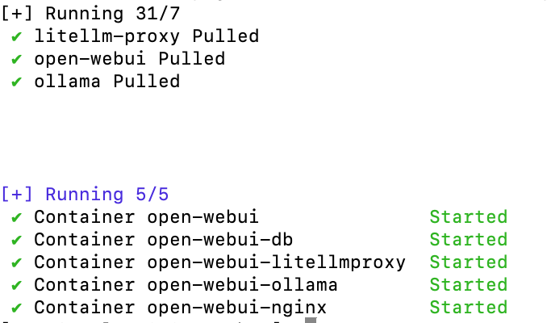
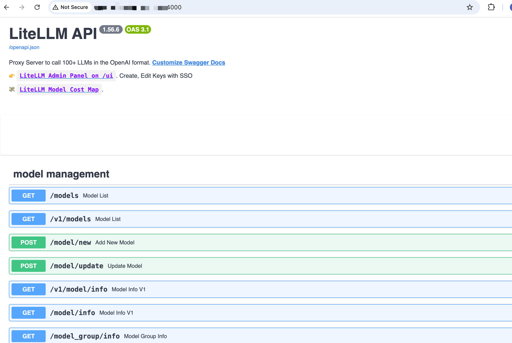
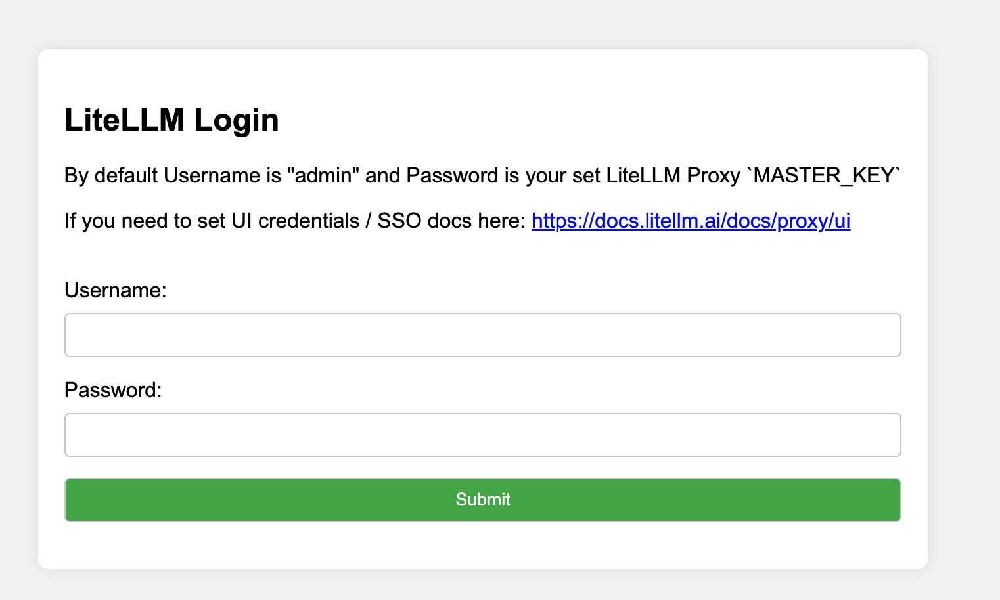

# Building Ollama with OpenWebUI Using OpenAI API Key on VPS/VM server

This guide will walk you through the setup and configuration of the system on a VPS server using Docker Compose, along with other configuration details for nginx and litellm.

## Directory Structure

Here's an overview of the project directory structure:

```batch
├── docker-compose.yaml
├── litellm
│   └── config.yaml
├── nginx
│   ├── certs
│   │   ├── fullchain.pem
│   │   ├── hostname-domain.crt
│   │   ├── hostname-domain.key
│   │   └── privkey.pem
│   └── nginx.conf
└── readme.md

4 directories, 8 files
```

## Prerequisites

Ensure you have Docker and Docker Compose installed on your VPS.
Set up your domain and acquire SSL certificates. You can use Let's Encrypt for free SSL certificates.

## Steps

**1. Configure Docker Compose**

Your [docker-compose.yaml](docker-compose.yaml) file is ready to orchestrate the different services. It includes containers for Ollama, Open-WebUI, litellm proxy, Postgres database, and nginx for SSL termination.

Docker Compose Services:

**ollama** : Handles interactions with Ollama services.
**open-webui** : Main interface for AI interactions.
**litellm-proxy** : Proxy service for OpenAI API interaction.
**db** : PostgreSQL database service for LiteLLM.
**nginx** : Reverse proxy service with SSL.

**2. Setup SSL with Nginx**

In the nginx directory, ensure your SSL certificates are correctly placed and your [nginx.conf](./nginx/nginx.conf) file is correctly configured. Replace "your-domainname.com" with your domain name.
Note: if you meet WebSocket error and show "No network" in chat dialog, here is [github issue](https://github.com/open-webui/open-webui/issues/8074). Following configure file includes this fix.

```conf
events {
    worker_connections 1024;
}
http {
    server {
        listen 443 ssl;

        server_name your-domainname.com;

        ssl_certificate /etc/nginx/certs/fullchain.pem;
        ssl_certificate_key /etc/nginx/certs/privkey.pem;

        ssl_protocols TLSv1.2 TLSv1.3;
        ssl_ciphers HIGH:!aNULL:!MD5;

        location / {
            proxy_pass http://open-webui:8080;

            # Add WebSocket support
            proxy_http_version 1.1;
            proxy_set_header Upgrade $http_upgrade;
            proxy_set_header Connection "upgrade";

            # Standard headers
            proxy_set_header Host $host;
            proxy_set_header X-Real-IP $remote_addr;
            proxy_set_header X-Forwarded-For $proxy_add_x_forwarded_for;
            proxy_set_header X-Forwarded-Proto $scheme;

            # Timeouts for WebSocket connections
            proxy_read_timeout 60s;
            proxy_send_timeout 60s;
        }

    }
}
```

**3 Configure LiteLLM**

Edit the [litellm/config.yaml](./litellm/config.yaml) file to set up your model parameters and keys.
Also here have two LLM, please add more LLMs that you will use.
Note: postgresql has root and root as rootuser and pwd, please update this, but should be the same as in "db" in [docker-compose.yaml](docker-compose.yaml) file

```yaml
model_list:
  - model_name: gpt-3.5-turbo
    litellm_params:
      model: "gpt-3.5-turbo"
      api_key: os.environ/OPENAI_API_KEY
      rpm: 20
      timeout: 300
      stream_timeout: 60
  - model_name: gpt-4o
    litellm_params:
      model: "gpt-4o"
      api_key: os.environ/OPENAI_API_KEY
      rpm: 20
      timeout: 300
      stream_timeout: 60
general_settings:
  master_key: your-liteLLM-MasterKey
  database_url: "postgresql://root:root@db:5432/litellmdatabase"
litellm_settings:
  drop_params: True
  set_verbose: False
```

**4. Start Your Services**

```batch
docker-compose up -d
```




```batch
docker exec -it ollama ollama pull nomic-embed-text
```


**5. Verify Your Setupe**

Once the services are running, verify the setup:

Access the UI at https://your-hostdomain.com or your specific domain.
Ensure all services are up and running without errors using docker-compose logs.

**6 (Optional) LiteLLM**

LiteLLM handles loadbalancing, fallbacks and spend tracking across 100+ LLMs. all in the OpenAI format. In web host server, we use LiteLLM to manager our LLM and related API key usage. Also this protect our primary OpenAI API Key. Check [LiteLLM Dococument](https://docs.litellm.ai/docs/).






**7 (Optional) Update Image Version or Shutdown**

To update your Docker images or shut down the containers, run:

```batch
docker compose down
```

```batch
docker compose pull
```

### Notes

- Remember to replace placeholders in configuration files with your actual API keys and domain details.
- The network **openwebui_network** must exist or be created if not automatically handled by Docker Compose.

## References

[open-webui](https://github.com/open-webui/open-webui)

[Ollama website](https://ollama.com/)

[Ollama models](https://ollama.com/search)

[Use Ollama with any GGUF Model on Hugging Face Hub](https://huggingface.co/docs/hub/en/ollama)

[LiteLLM](https://www.litellm.ai/)

[LiteMM Dococument](https://docs.litellm.ai/docs/)
